# Atlas

A visual **drag & drop page builder for Laravel 12 and 13** — with light/dark mode, translations, a portfolio block kit, animated blocks, and complete freedom to write your own code.

* **Visual editor** – drag blocks onto a live canvas, nest them, reorder by dragging, edit in an inspector, undo/redo, desktop/tablet/mobile preview.
* **28 built-in blocks** – layout, content, **portfolio**, **animated** and utility blocks.
* **Light & dark mode** – automatic, forced, or a visitor toggle. No flash of the wrong theme.
* **Translations** – translate any text per language, language switcher, `/{locale}/…` URLs, translated editor UI (English, Dutch).
* **Animations** – entrance & hover effects on every block, plus counters, typewriter, marquee, carousel, parallax, Lottie. Respects *reduce motion*.
* **Custom code, three ways** – raw HTML/CSS/JS, PHP + Blade blocks, and a no-PHP **block builder** inside the editor.
* **Ships as a package** – `atlas:package` turns your finished site (blocks, pages, media) into a publishable Composer package.
* **No build step** – the editor and the page runtime are dependency-free JavaScript shipped with the package.
* **Secure by default** – the editor is closed outside `local` until you decide who may use it.

<p align="center">
  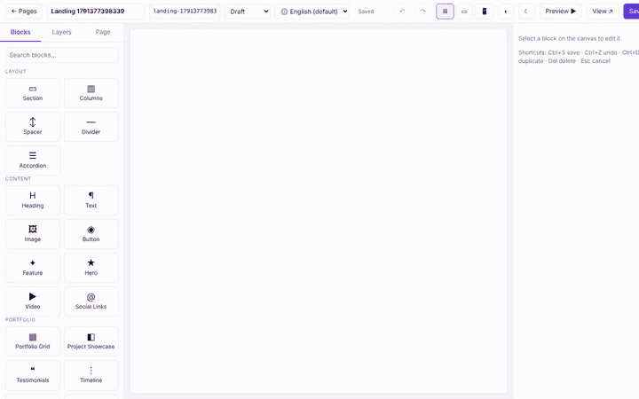
</p>

## See it

| Light | Dark |
|-------|------|
| 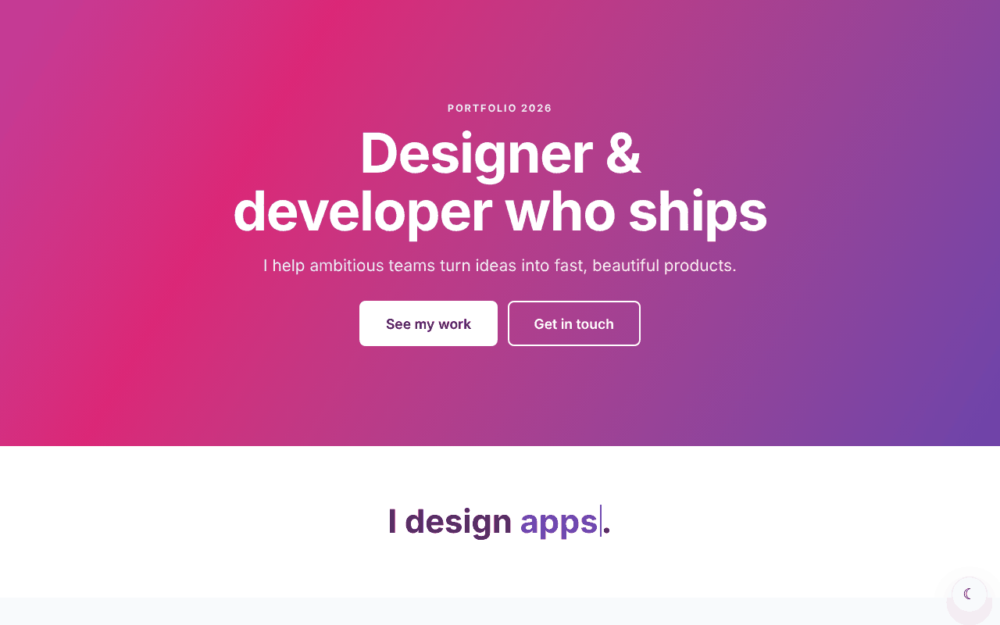 | 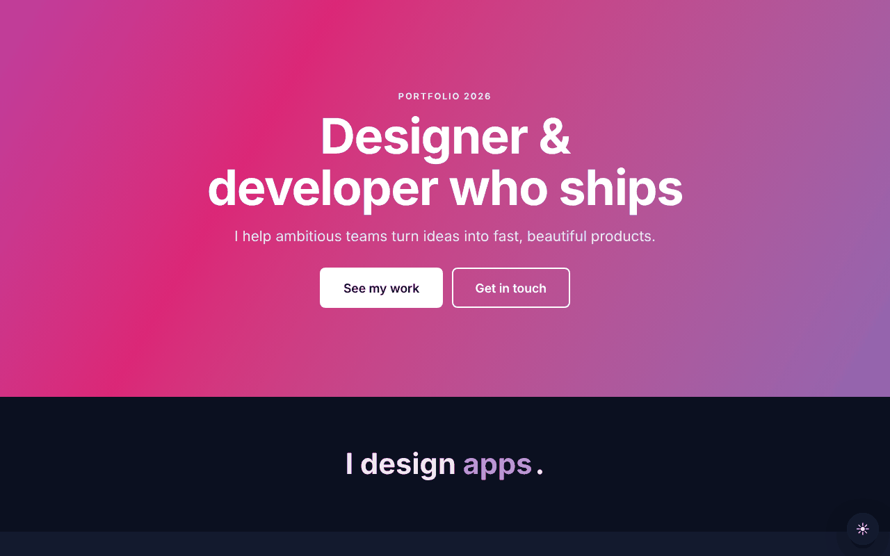 |

| Portfolio grid | Mobile |
|----------------|--------|
| 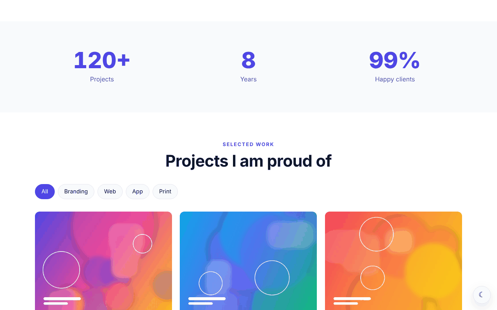 | 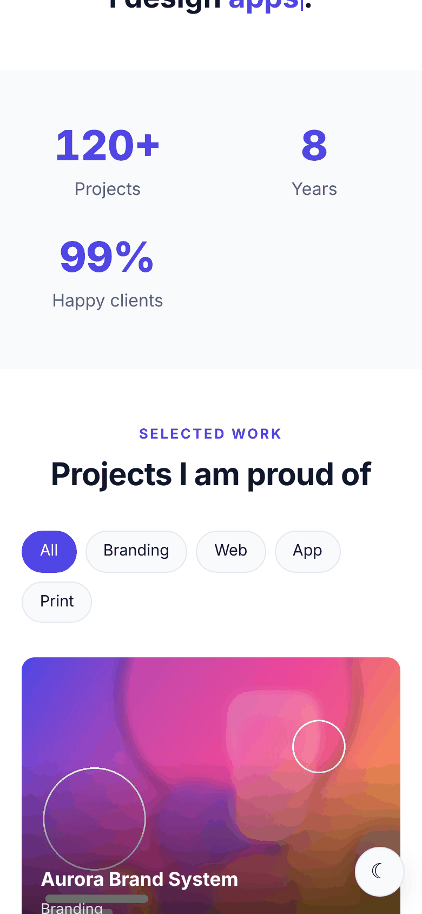 |

<details>
<summary><strong>More screenshots & GIFs</strong></summary>

**Editor** — blocks palette, live canvas, inspector with repeaters, translations and animation settings
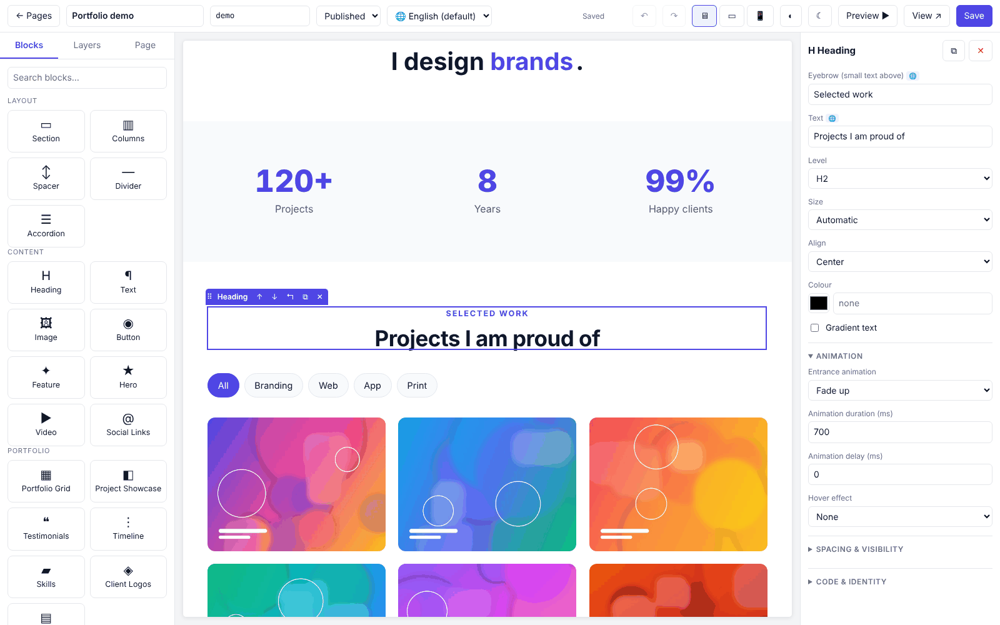
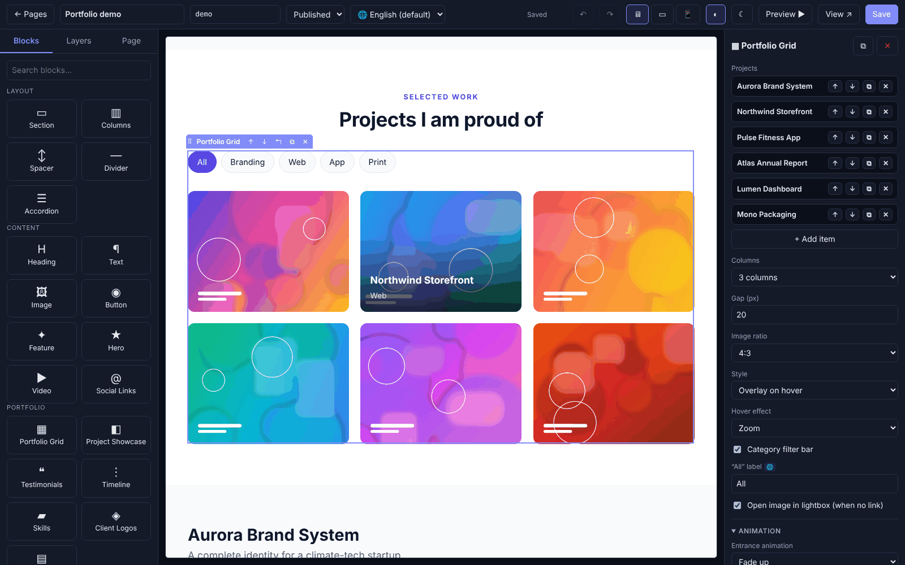
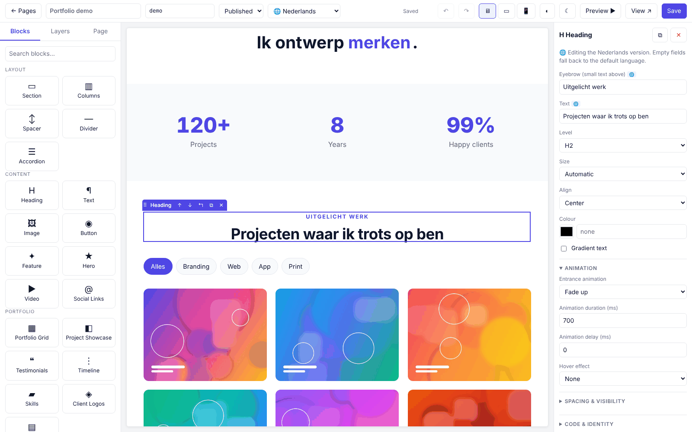
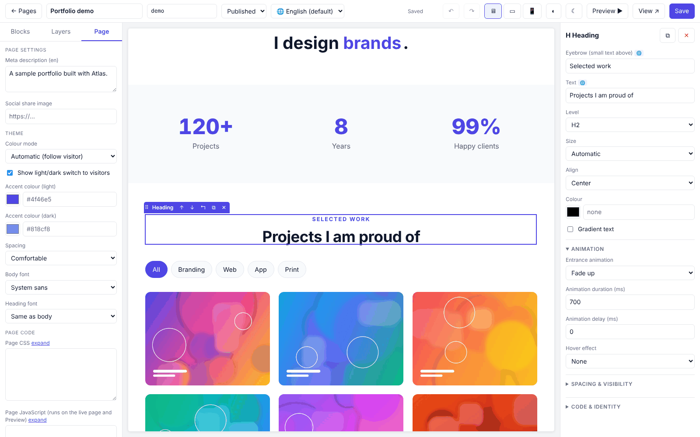
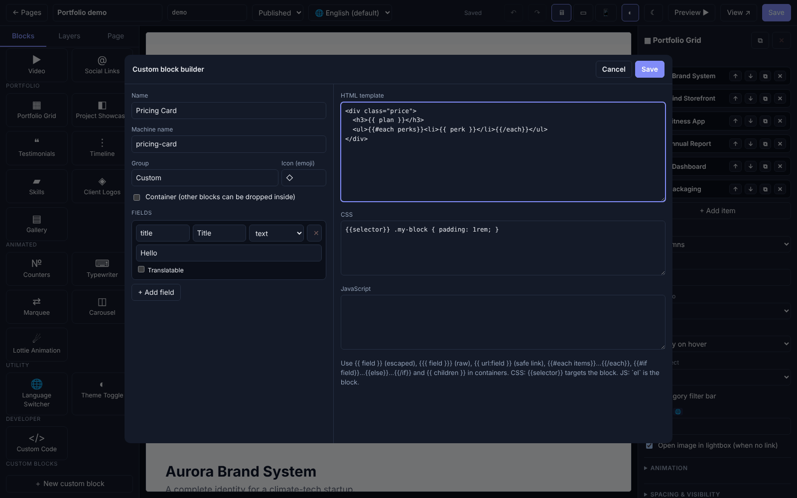

**Dark / light mode** &nbsp; 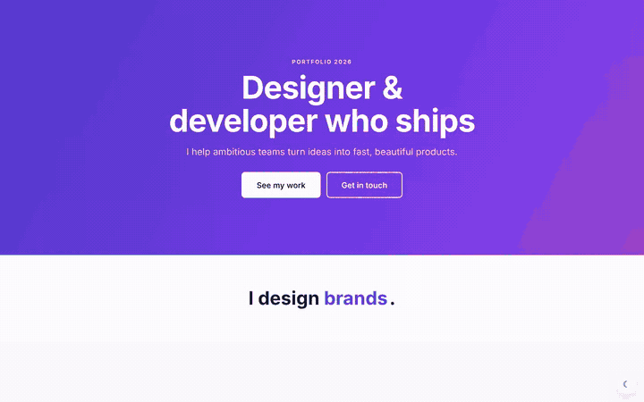

**Portfolio filter & lightbox** &nbsp; 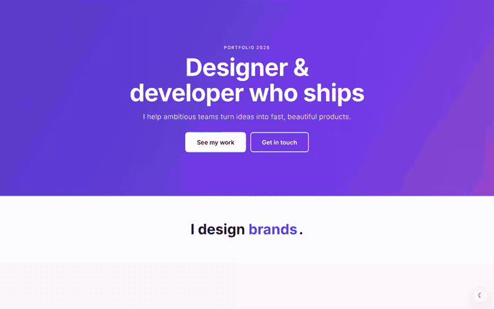

**Scroll animations, counters, typewriter** &nbsp; 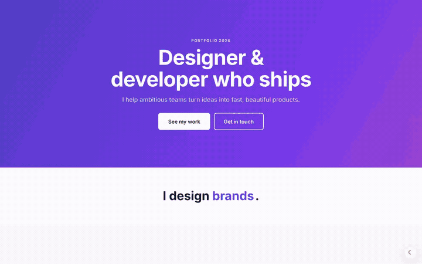

**Translations** &nbsp; 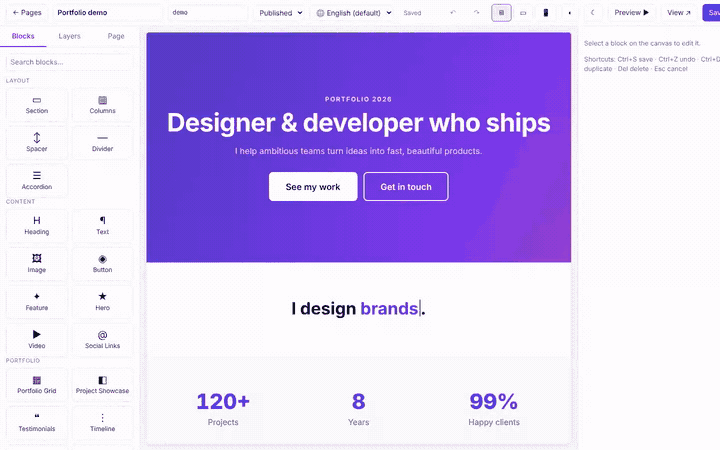

**Block builder (no PHP)** &nbsp; 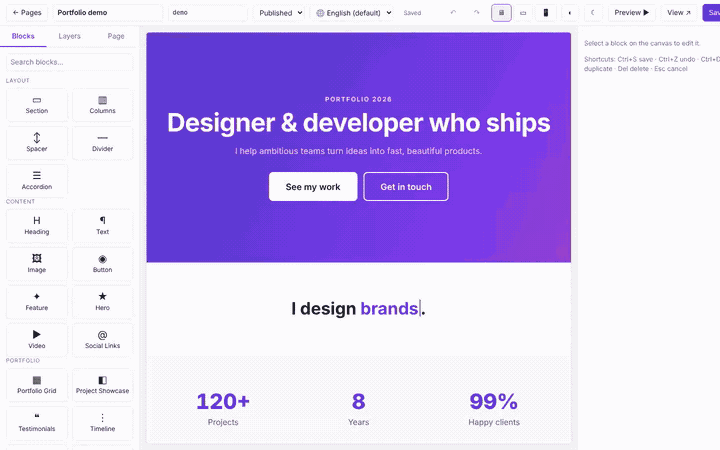

</details>

## Install

```bash
composer require streats22/atlas
php artisan atlas:install      # publishes config/atlas.php and runs the migrations
php artisan atlas:demo         # optional: a complete sample portfolio page at /demo
```

Open **`/atlas`**, create a page and start dragging. Published pages are served at `/{slug}`; the page with slug `home` is also served at `/` when your app has no `/` route.

Requirements: PHP 8.3+, Laravel 12 or 13.

## Who can use the editor?

Atlas checks the `useAtlas` gate. By default only the `local` environment is allowed. In production:

```php
// AppServiceProvider::boot()
use Atlas\Facades\Atlas;

Atlas::auth(fn ($user) => $user?->is_admin);
// or: Gate::define('useAtlas', fn ($user) => $user?->hasRole('editor'));
```

Everyone with editor access can write raw HTML/JS — treat it as a developer-level permission.

## The editor

| Area | What it does |
|------|--------------|
| **Blocks** tab | Drag a block onto the canvas (or click to add after the selection). Search, grouped by Layout / Content / Portfolio / Animated / Utility / Developer. Your own blocks appear here too. |
| **Canvas** | The real server-rendered page. Click to select, drag the ⠿ handle to move, toolbar for ↑ ↓ ⧉ ✕, “select parent”. Drop *inside* containers or *between* blocks (blue indicator). |
| **Layers** tab | The page tree; click to select. |
| **Page** tab | Colour mode, accent colours, fonts, meta description, share image, and page CSS / JS / `<head>` code. |
| **Inspector** | Fields for the selected block, plus *Animation*, *Spacing & visibility* and *Code & identity* sections. |
| **Top bar** | Title, slug, status, **content language**, device sizes, **canvas light/dark preview** `◐`, **editor light/dark** `☾`, undo/redo, Preview, Save. |

Shortcuts: `Ctrl/⌘+S` save · `Ctrl/⌘+Z` undo · `Ctrl/⌘+Shift+Z` redo · `Ctrl/⌘+D` duplicate · `Del` delete · `Esc` deselect / cancel drag.

> Scripts do not run inside the editor canvas (so a broken script can never freeze the editor). Press **Preview ▶** to see JavaScript and animations for real.

## Built-in blocks

| Group | Blocks |
|-------|--------|
| **Layout** | Section (tone, background colour/image, overlay, **parallax**, width, min-height), Columns (1–4, gap, stack/reverse on mobile), Spacer, Divider, Accordion |
| **Content** | Heading (eyebrow, sizes, gradient text), Text (**Markdown**), Image (ratio, caption, lightbox), Button, Feature (icon box), Hero (animated gradient or image), Video (YouTube / Vimeo / file), Social links |
| **Portfolio** | **Portfolio Grid** (category filter, lightbox, overlay/caption styles, hover effects), **Project Showcase**, **Testimonials** (grid or carousel), **Timeline**, **Skills**, **Client Logos** (optional marquee), **Gallery** (lightbox) |
| **Animated** | **Counters** (count-up), **Typewriter**, **Marquee**, **Carousel**, **Lottie** |
| **Utility** | Language switcher, Theme toggle |
| **Developer** | Custom Code, Blade Code (opt-in) |

List everything registered in your app: `php artisan atlas:blocks`.

## Spacing

Pages breathe by default. A **Spacing** setting (Page tab: *Compact / Comfortable / Spacious*, or `theme.spacing` in config) drives three CSS variables used by every block:

| Variable | Compact → Comfortable → Spacious | Used for |
|----------|----------------------------------|----------|
| `--atlas-space` | .75rem → 1.5rem → 2.5rem | vertical rhythm between sibling blocks |
| `--atlas-section-y` | 40px → 72px → 112px | default Section padding (leave *Vertical padding* empty to use it) |
| `--atlas-gutter` | 20–40px (responsive) | page side padding |

Blocks placed directly on the page (outside a Section) automatically get the same gutters and rhythm, headings sit closer to the text that follows them, and cards, quotes and accordions have generous inner padding. Override any block with *Spacing & visibility → Margin top/bottom*.

## Light & dark mode

Every block is styled with CSS variables, so pages read correctly in both modes.

* **Per page** (Page tab): *Automatic* (follow the visitor’s system), *Always light*, *Always dark*; an optional **light/dark switch** for visitors (remembered in `localStorage`); accent colour for each mode; body and heading font (system, serif, mono, rounded).
* **Global defaults** in `config/atlas.php`:

```php
'theme' => [
    'default' => 'auto', 'toggle' => false,
    'accent' => '#4f46e5', 'accent_dark' => '#818cf8',
    'font' => 'system', 'heading_font' => 'same',
    'light' => ['bg' => '#fff'],            // override any design token…
    'dark'  => ['bg' => '#05070d', 'surface' => '#0d1220'],
],
```

* **Use the tokens in your own code** — `--atlas-bg`, `--atlas-surface`, `--atlas-surface-2`, `--atlas-text`, `--atlas-muted`, `--atlas-border`, `--atlas-accent`, `--atlas-accent-contrast`, `--atlas-shadow`, `--atlas-font`, `--atlas-heading-font`:

```css
.my-card { background: var(--atlas-surface); border: 1px solid var(--atlas-border); color: var(--atlas-text); }
```

* The page theme is exposed as `data-atlas-theme="auto|light|dark"` on `<html>`; target it for custom dark tweaks: `[data-atlas-theme=dark] .logo { filter: invert(1); }`.
* JavaScript: `Atlas.theme('dark')`, `document.addEventListener('atlas:theme', e => …)`.
* Blocks with a **Tone** (Surface / Accent / Inverted) re-map the tokens for their children, so headings, buttons and links stay readable on coloured sections.

## Translations

### Translating content
1. Add locales in `config/atlas.php` (or `ATLAS_LOCALES="en:English,nl:Nederlands"`):
   ```php
   'locales' => ['en' => 'English', 'nl' => 'Nederlands'],
   'default_locale' => 'en',     // defaults to config('app.locale')
   ```
2. In the editor pick a **content language** in the top bar. Fields marked 🌐 (headings, text, button labels, repeater items…) now edit that language; empty fields fall back to the default language. Page title and meta description are translatable too.
3. Visitors get their language via `?lang=nl` (remembered in the session), or — with `'frontend' => ['locale_prefix' => true]` — via `/nl/about` (the default language stays at `/about`). `hreflang` links, `<html lang>` and `dir="rtl"` (ar, he, fa, ur) are output automatically. Add the **Language switcher** block anywhere.

Translations are stored next to the default value as `name@locale`, so removing a language never loses data.

### Translating the editor
The editor UI ships in **English** and **Dutch** and follows `app()->getLocale()`. Add a language by publishing and copying the files:

```bash
php artisan vendor:publish --tag=atlas-lang    # → lang/vendor/atlas/en/*.php
```

`ui.php` holds editor strings; `blocks.php`, `fields.php`, `options.php` and `categories.php` translate block names, field labels, option labels and palette groups.

## Animations

**Entrance** – every block has *Animation* settings in the inspector: Fade in / up / down / left / right, Zoom in / out, Flip, Blur; duration and delay. The effect plays when the block scrolls into view. **Hover** – Lift, Zoom, Glow.

**Animated blocks** – *Counters* count up when visible, *Typewriter* cycles words, *Marquee* scrolls text (pauses on hover), *Carousel* has arrows, dots, swipe and autoplay, *Parallax* is an option on *Section*, *Hero* has an animated gradient, *Lottie* plays any Lottie JSON (the library loads only on pages that use it).

Details:
* Progressive enhancement – without JavaScript everything is simply visible.
* `prefers-reduced-motion` is respected everywhere.
* An ~11 KB (unminified) runtime is inlined **only on pages that need it**. Re-initialise dynamically added content with `Atlas.init(element)`; listen to `atlas:reveal` and `atlas:filter` events.
* Need GSAP, AOS or another library? Load it globally (`Atlas::script(...)`), per block (`assets()`), or in a Custom Code block.

## Portfolio blocks

Typical portfolio page: **Hero → Counters → Portfolio Grid → Project Showcase → Skills + Timeline → Testimonials → Contact**. Run `php artisan atlas:demo` to see it.

* **Portfolio Grid** – add projects as items (image, title, category, description, link, tags). With two or more categories a **filter bar** appears; clicking an image with no link opens a **lightbox**. Styles: *overlay on hover*, *caption below*, *minimal*; hover: zoom / lift.
* **Project Showcase** – one project with image, summary, Markdown description, detail rows (Client / Role / Year…), tags and a link; image left or right.
* **Testimonials**, **Timeline**, **Skills**, **Client Logos**, **Gallery** – all use the repeater editor (add, reorder ↑↓, duplicate, remove).
* Upload images from the inspector (stored on the `public` disk, see `atlas.uploads`) or paste URLs.

## Custom code

### 1. The Custom Code block
Three editors — **HTML** (output as written), **CSS** (`{{selector}}` targets this block only: `{{selector}} h2 { color: red }`) and **JavaScript** (runs on the live page and in Preview; wrapped in its own scope with `el` = the block element; untick *Isolate* for plain global script).

Every block also has **CSS classes**, **HTML id** and **Custom CSS** under *Code & identity*.

### 2. Page-level code
Page tab → page CSS, page JavaScript, extra `<head>` HTML.

### 3. Libraries & your own layout
```php
Atlas::style('https://cdn.jsdelivr.net/npm/some-lib/dist/lib.css');   // also loads in the editor canvas
Atlas::script('https://cdn.jsdelivr.net/npm/alpinejs@3/dist/cdn.min.js', defer: true);
```
Use your own theme by pointing `atlas.layout` at a Blade view:

```blade
<html {{ $htmlAttributes }}><head><title>{{ $title }}</title>@vite('resources/css/app.css'){{ $head }}</head>
<body>@include('partials.nav'){{ $content }}{{ $scripts }}</body></html>
```
(`$head` carries Atlas’s base styles, theme variables and meta tags — keep it.)

### 4. Blade code block (opt-in)
`'allow_blade_code' => true` adds a block that compiles editor-written Blade/PHP — remote code execution for anyone with editor access. Only enable it for trusted developers.

Disable all raw-code features with `'custom_code' => false`.

## Creating custom blocks

### A. In the editor (no PHP) — the Block builder
Blocks tab → **＋ New custom block**.

1. Name it, pick a group and icon, tick *Container* if other blocks may be dropped inside.
2. Add **fields**: text, textarea, number, select (`value:Label, value:Label`), colour, checkbox, image, code, or a **repeater** (`name:type, name:type`). Tick *Translatable* on text fields.
3. Write the **HTML template**, **CSS** and **JavaScript**.

```html
<div class="price">
  <h3>{{ plan }}</h3>
  <ul>{{#each perks}}<li>{{ @number }}. {{ perk }}</li>{{/each}}</ul>
  {{#if highlight}}<strong>Popular</strong>{{else}}<span>Standard</span>{{/if}}
  <a href="{{ url:link }}">Buy</a>
</div>
```

| Syntax | Meaning |
|--------|---------|
| `{{ field }}` | HTML-escaped value |
| `{{{ field }}}` | raw value (trusted) |
| `{{ url:field }}` | escaped link with `javascript:` / `data:` neutralised |
| `{{#each items}}…{{/each}}` | loop; inside use item fields, `{{ @index }}`, `{{ @number }}` |
| `{{#if field}}…{{else}}…{{/if}}` | condition |
| `{{ children }}` | child blocks (containers) |

CSS: `{{selector}}` targets the block. JS: `el` is the block element. The template language never executes PHP. Blocks are stored in the `atlas_blocks` table and can be edited or deleted from the palette (✎).

### B. As a PHP class + Blade view (full power)
```bash
php artisan atlas:make-block PricingTable --container --group=Marketing --icon=💰
```
creates `app/Atlas/Blocks/PricingTable.php` and `resources/views/atlas/blocks/pricing-table.blade.php`; blocks in `app/Atlas/Blocks` are discovered automatically.

```php
class PricingTable extends Block
{
    public function type(): string { return 'pricing-table'; }
    public function label(): string { return __('Pricing table'); }
    public function category(): string { return 'Marketing'; }

    public function fields(): array
    {
        return [
            Field::t(Field::text('heading', 'Heading', 'Pricing')),          // 🌐 translatable
            Field::select('currency', ['usd' => 'USD', 'eur' => 'EUR']),
            Field::repeater('perks', [Field::t(Field::text('perk'))], 'Perks', [['perk' => 'Fast']]),
        ];
    }

    public function data(array $props): array          // run any PHP you like
    {
        return ['plans' => Plan::active()->get()];
    }

    public function assets(): array                    // loaded only on pages using this block
    {
        return ['scripts' => [['src' => 'https://…/chart.js', 'defer' => true]]];
    }
}
```

In the view you have `$props`, `$children`, `$node`, `$id`, `$domId`, `$editing`, `$locale` and `$safe($url)`.

Field helpers: `Field::text / textarea / number / select / color / checkbox / image / url / code / repeater`, wrap with `Field::t(...)` to make translatable. Override `container()`, `defaultChildren()`, `icon()`, `category()` as needed. Override `render()` for full control.

### C. View-only, fluent
```php
Atlas::viewBlock('hero-banner', 'blocks.hero', 'Hero banner', [Field::text('title')], category: 'Marketing');
```

Block labels, field labels and options are translatable through `lang/vendor/atlas/{locale}/blocks.php`.

## Ship your site as a package

Finished a site? Turn it into something you can `composer require` anywhere.

```bash
php artisan atlas:package acme/portfolio-site --dry-run     # see what would be included
php artisan atlas:package acme/portfolio-site --archive     # generate packages/acme/portfolio-site (+ .zip)
```

The packager is *smart*: it finds your developer blocks (`app/Atlas/Blocks`, namespace rewritten to the package's), their views (`resources/views/atlas`), your translations (`lang/vendor/atlas`) and exports your **pages, the builder blocks they use and the uploaded images** into a bundle. It generates a complete package:

```
composer.json · README · LICENSE · CHANGELOG · .gitignore · .gitattributes · phpunit.xml.dist
src/AcmePortfolioSiteServiceProvider.php   (registers blocks + views, `acme:install` command)
src/Blocks/*  ·  resources/views/atlas/*  ·  lang/*
resources/atlas/bundle.json + media/       (your content)
tests/PackageTest.php  ·  .github/workflows/tests.yml (PHP 8.3/8.4 × Laravel 12/13)
```

It warns when a block references your app's own classes (`App\Models\…`), lints every generated PHP file, refuses to overwrite without `--force`, and prints the next steps (local path-repository test, tag, submit to Packagist). Consumers then run:

```bash
composer require acme/portfolio-site
php artisan portfolio-site:install        # imports pages, builder blocks and images (--force to overwrite)
```

Options: `--pages=home,about` · `--all-blocks` · `--no-pages` · `--no-blocks` · `--no-media` · `--namespace=` · `--author=` · `--license=` · `--path=`.

**Moving content without a package**

```bash
php artisan atlas:export site.zip            # pages + builder blocks + images (.json = content only)
php artisan atlas:import site.zip --force    # into another install (image URLs are rewritten automatically)
```

Bundles are validated on import (format version, block names, path-traversal-safe zips) and never overwrite existing pages unless `--force`.

## Embedding pages in your own views
```blade
<x-atlas::page slug="footer" />        {{-- content + page CSS/JS --}}
{!! Atlas::page('footer') !!}          {{-- content only --}}
```

## Configuration reference

| Key | Default | Purpose |
|-----|---------|---------|
| `path` / `middleware` | `atlas` / `['web']` | editor URL and middleware |
| `frontend.enabled / prefix / home / locale_prefix` | `true / '' / 'home' / false` | public page routing |
| `layout` | `atlas::layouts.document` | page layout view |
| `custom_code` | `true` | raw HTML/CSS/JS, block builder |
| `allow_blade_code` | `false` | Blade Code block |
| `locales` / `default_locale` | `[]` / app locale | content languages |
| `theme.*` | see above | colour mode, accent, fonts, spacing, tokens |
| `cdn.lottie` | jsDelivr | Lottie player URL |
| `assets.styles / scripts` | `[]` | global libraries |
| `discover.path / namespace` | `app/Atlas/Blocks` | block auto-discovery |
| `blocks` | `[]` | extra block classes |
| `uploads.disk / directory / max_kb` | `public / atlas / 5120` | image uploads |

## Artisan commands

| Command | |
|---------|-|
| `atlas:install` | publish config, migrate |
| `atlas:demo [--slug=demo] [--force]` | sample portfolio page |
| `atlas:make-block Name [--container] [--group=] [--icon=]` | scaffold a block |
| `atlas:blocks` | list registered blocks |
| `atlas:export [file] [--pages=] [--all-blocks] [--no-media]` | portable bundle of pages, builder blocks, media |
| `atlas:import file [--force]` | import a bundle |
| `atlas:package vendor/name [--dry-run] [--archive] …` | generate a publishable package from this site |

Publish tags: `atlas-config`, `atlas-views`, `atlas-lang`, `atlas-migrations`.

## Code quality

* **PSR-12** (enforced by Pint — `composer lint` / `composer fix`) with `declare(strict_types=1)` everywhere.
* Object-oriented and DRY: single-purpose classes, constructor injection, enums and value objects (`PageStatus`, `ThemeMode`, `Spacing`, `Theme`, `PageMeta`), thin controllers with `FormRequest`s.
* **SQL-injection safe** — every query is bound through Eloquent; the suite fails if raw SQL APIs appear in `src/`, and tests throw hostile payloads at slugs, block names, titles and query strings.
* CI runs lint, JS syntax checks and the test-suite on PHP 8.3/8.4 × Laravel 12/13. See [`AGENTS.md`](AGENTS.md) / [`CLAUDE.md`](CLAUDE.md) for contributor and AI-agent guidance.

## Security notes
* Editor routes require the `useAtlas` gate and CSRF; responses are `noindex`.
* Block output is escaped; links/images pass a scheme allow-list (`http`, `https`, `mailto`, `tel`). Text blocks use Markdown with raw HTML stripped.
* Raw HTML/JS (Custom Code, page code, `{{{ raw }}}` in builder templates) is **not** sanitised — it is the point. Only trust editors with it, or set `custom_code` to `false`.
* Uploads accept raster images only (no SVG).

## Testing
```bash
composer install && vendor/bin/phpunit
```
Dev server with sample data: `vendor/bin/testbench serve` (see `testbench.yaml`).

## License
MIT
